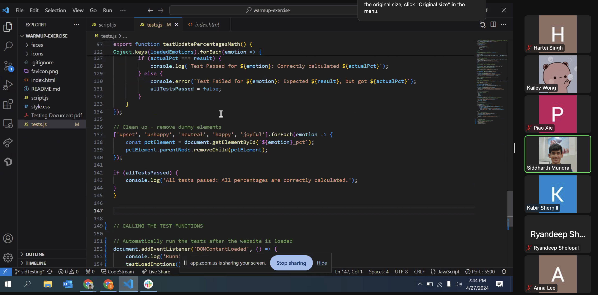
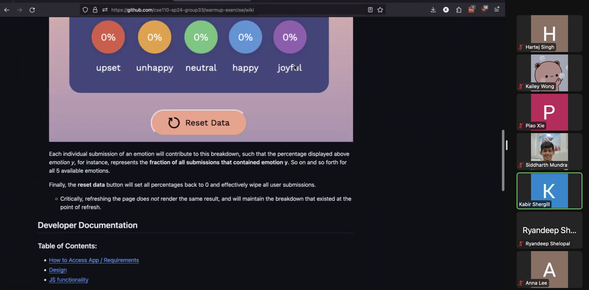

# Warmup Sprint Review
- **Date:** April 27, 2024
- **Time:** 2:30-3:00 PM
- **Location:** Zoom
- **Attendees:** Kailey, Sid, Anna, Jackson, Piao, Kabir, Hartej, Ryan
- **Absent:** Johnny

## Agenda
1. Introduction
2. Review of Goals and Objectives
3. Overview of Work and Learning
4. Demonstration of Completed Work
5. Discussion Items

## Discussion Points:

### Introduction
Meeting purpose: review the work completed!

### Review of Goals and Objectives
- Getting more familiar with the tech stack
- Learning to work as a team and Git workflow

### Overview of Work and Learning
- Sid
  - Learning JavaScript for testing
  - Learning about the Git workflow
  - Learning to write tests with AI help
- Jackson
  - Learning JavaScript, Git workflow
  - Working on local storage
- Anna
  - Practicing CSS
  - Matching website design to prototype
  - Collaborative work on GitHub
- Ryan
  - Practiced Git workflows
  - Worked on CSS
- Piao
  - Worked on HTML
  - Learning GitHub issues
  - Using live server with VSCode
- Hartej
  - Worked on JavaScript calculations and form interactions
  - Learning Git workflow
- Kabir
  - Worked on documentation (user and developer)
- Kailey
  - Learning web project organization, task delegation
  - Code review attention to detail

## Demonstration of Completed Work
- **Testing (Sid):**
  - Mocked localStorage to check values
  - Checked UI updates, resets, and math accuracy
  - Debugged initial errors
  - Tested documentation
- **Documentation (Kabir):**
  - Described functionalities for users and design philosophy
  - Organized code
- **JavaScript (Hartej):**
  - Tracked selected emotions
  - Stored emotion counts
- **JavaScript (Jackson):**
  - Saved data to local storage
  - Reset local storage data
- **CSS (Ryan):**
  - Utilized flexbox for website layout
  - Added hover effects
- **HTML (Piao):**
  - Designed layout for each emotion
  - Added images and labels
- **CSS (Anna):**
  - Incorporated background colors and flexboxes
  - Styled emojis
- **HTML/CSS (Kailey):**
  - Structured HTML form
  - Added branding styling and animations
  - Implemented percentages breakdown

Images:

